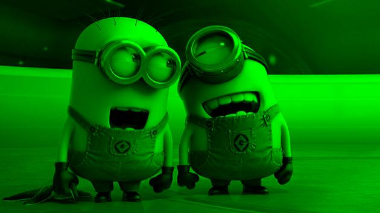
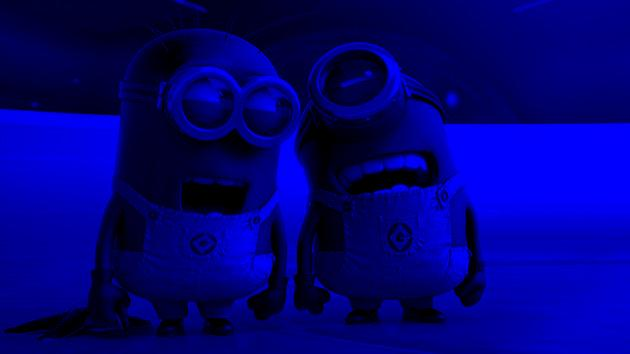

# ImageColorConversion

Converts a JPG file into its grayscale, red, green, and blue converted form.

## Getting Started

These instructions will get you a copy of the project up and running on your local machine for development and testing purposes.

### Prerequisites

```
Eclipse
```

## Running the tests

Type the name of the file you wish to convert and press enter. The program will then pop up the different color conversions of the image.






## Authors

* **Steven Duong**


